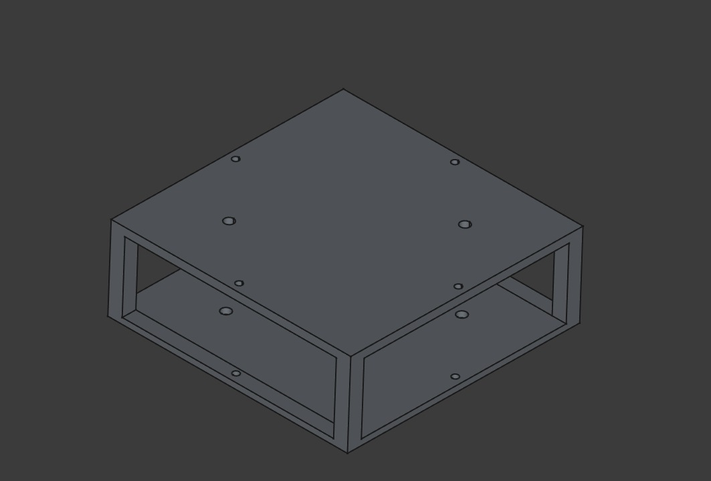
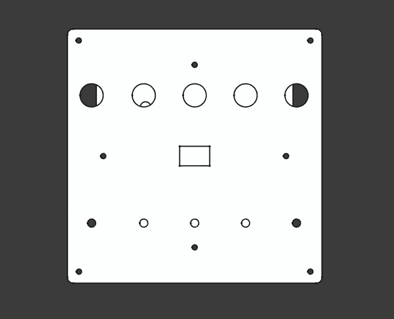
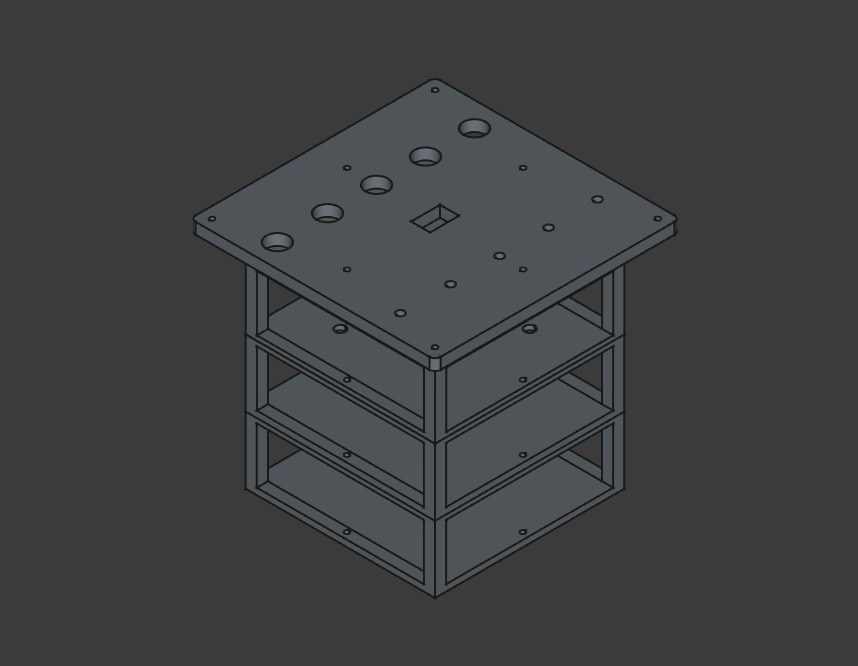
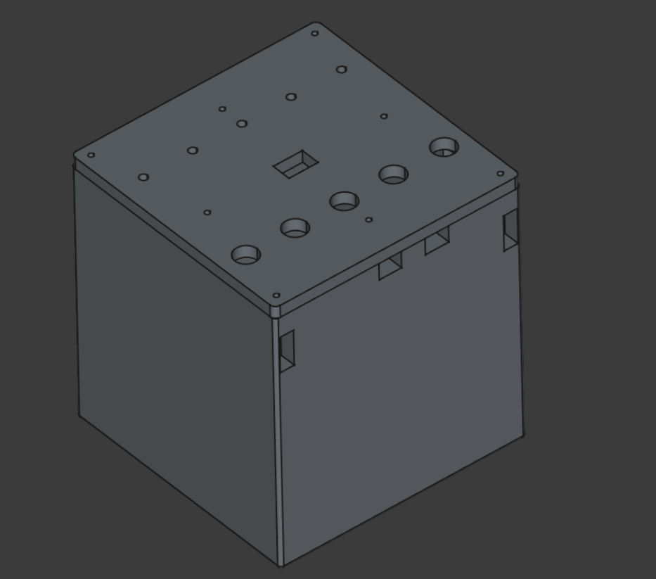

Single Compartment

Top View

Assembly (Without the enclosure)

Fully Assembled Model of TerraPulse

All the mounting holes in this assembly are regular ISO Metric M4 holes (4.50mm diameter).

The spacers have a height of 22mm